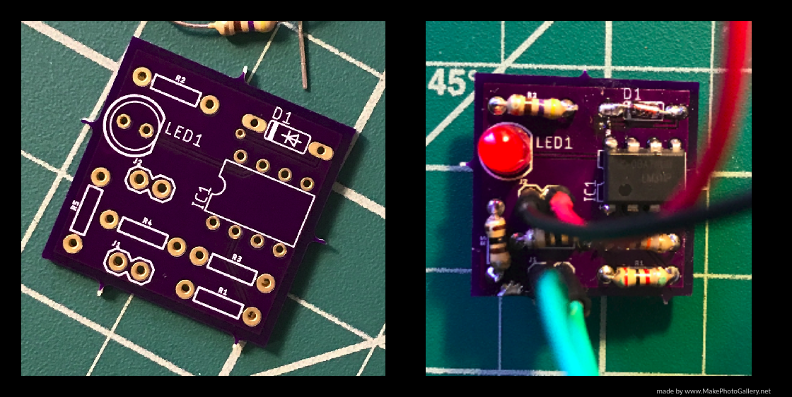

# Self-Designed-PCB-Continuity-Tester

<h2>Tools</h2>
<ul>
  <li>Soldering Iron</li>
  <li>Solder</li>
</ul>  

<h2>Motivation for the Project</h2>

As a final project for my Circuits 1 course, I tested and designed my own continuity tester using LTspice and Eagle then having it manufactured by OshPark. It took three hours to get comfortable with LTspice and Eagle, but then after than it was simple to create my model for the continuity tester printed circuit board (PCB). Once I received the PCB boards I started soldering the components, but one mishap was not ordering a soldering socket for the IC1 on the circuit board since I could then remove the IC from the board with the need for desoldering. After soldering all the components, I verified my continuity tester worked by inserting the red and black soldered in wires on the PCB to my Arduino’s 5V and GND ports, which caused the continuity tester’s red LED lit up as was intended. Although, my PCB functioned I learned I needed to improve my soldering skills since I was quite messy with this board and I did not properly clean the board after I was done to make it presentable, so I hope to improve my soldering skills this summer.
